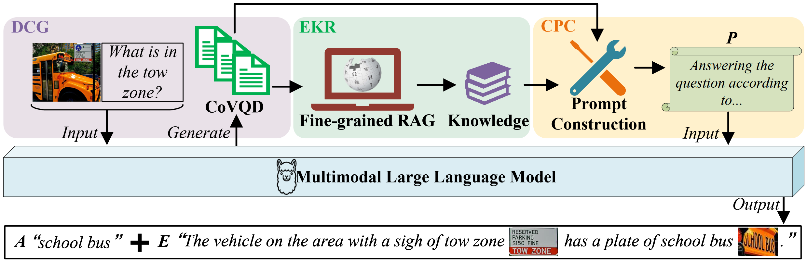
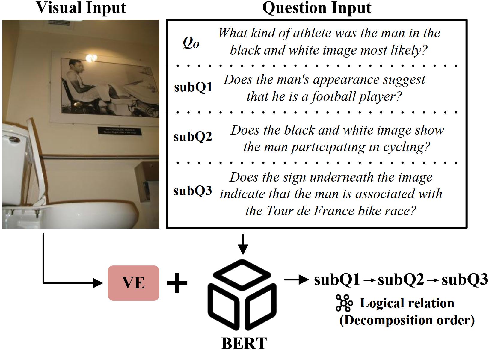
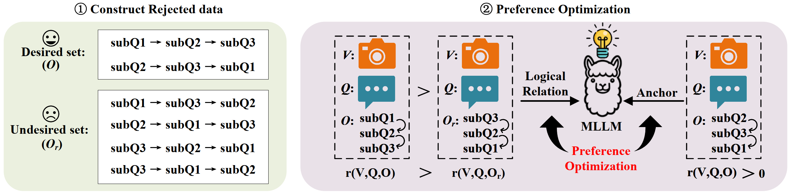

# CgRAG
**Enhancing Visual Question Answering with Multimodal LLMs via Chain-of-Question Guided Retrieval-Augmented Generation.**
## Overview
We introduce a logical prompting strategy that fuses Chain‑of‑Thought (CoT) reasoning with Visual Question Decomposition (VQD), termed CoVQD, to guide retrieval toward more accurate and relevant knowledge for MLLM inference. Building on this idea, we propose a new framework, **C**oVQD‑**g**uided **RAG** (CgRAG), which enables MLLMs to access more comprehensive and coherent external knowledge while benefiting from structured visual‑text reasoning guidance, thereby improving generalization and reliability in complex cross‑domain VQA scenarios. 

## VQD and liDPO
To further enhance the model’s ability to capture logical relations among sub-questions, we introduce **l**ogical **i**mplication **D**irect **P**reference **O**ptimization (liDPO) during fine-tuning. We employ a pre-trained BERT with a visual encoder to predict logical relations among sub-questions conditioned on both visual and textual inputs. These relations are then used to construct preference pairs for liDPO.

## Multimodal RAG
Three retrieval processes are involved: original image retrieval, multimodal retrieval, and CoVQD-guided retrieval. $I$, $C$, $E$, and $K$ denote Image, Caption, Explanation, and Knowledge, respectively. $Q_O$ and CoVQD serve as supervisors for filtering out visual information irrelevant to reasoning.

